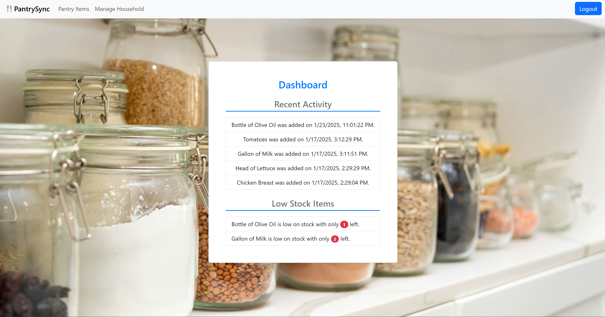
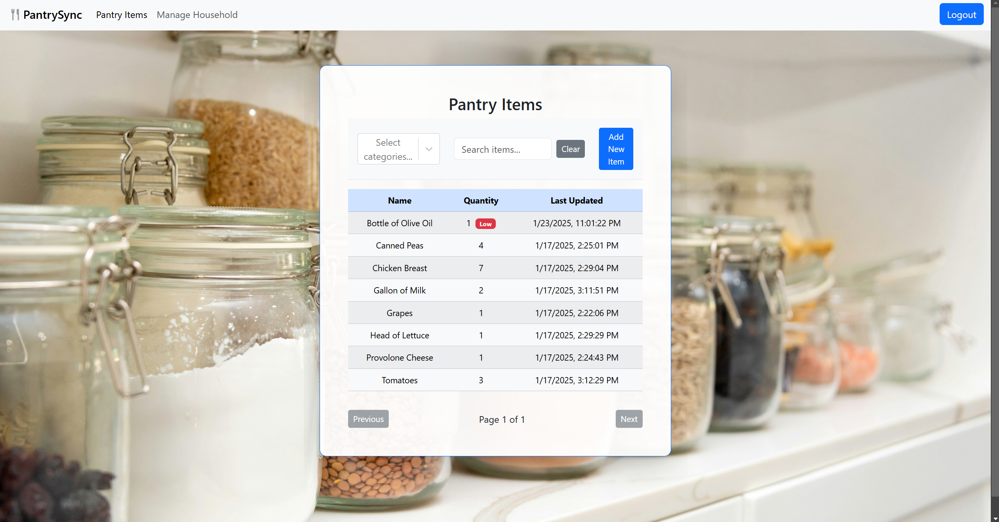
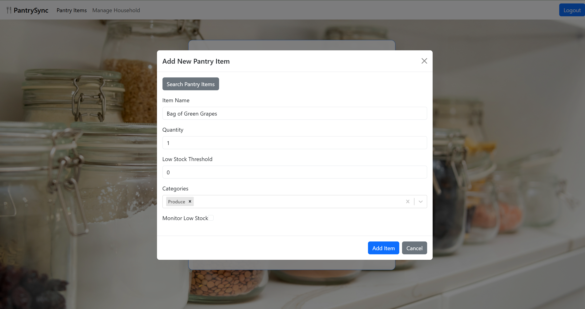
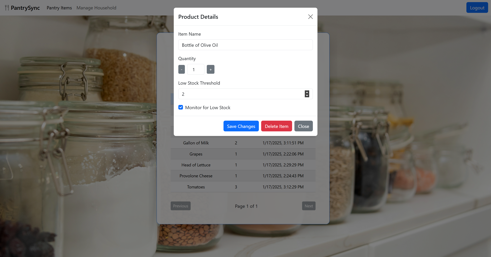

# PantrySync

PantrySync is a web application designed for families and shared households to manage pantry items efficiently. The app helps prevent duplicate purchases and notifies users when items are low on stock. It simplifies household inventory management and encourages collaboration among members.
---

## Table of Contents

- [Features](#features)
- [Technologies Used](#technologies-used)
- [Getting Started](#getting-started)
- [Setup](#setup)
  - [Backend Setup](#backend-setup)
  - [Frontend Setup](#frontend-setup)
  - [Database Migration](#database-migration)
  - [Alternative Configuration](#alternative-configuration)
- [Usage](#usage)
- [External API](#external-api)
- [Screenshots](#screenshots)
- [What I Learned](#what-i-learned)
- [Acknowledgments](#acknowledgments)

---

## Features

- **Household Management**:
  - Create or join a household using unique join codes.
  - Admins can remove members and manage household settings.
- **Pantry Item Tracking**:
  - Add, update, and remove items.
  - Track stock levels and receive alerts for low-stock items.
- **Roles**:
  - **Household Admin**: Manages the household, including join codes and member removal.
  - **Member**: Participates in managing pantry items.
- **Authentication**:
  - Secure user accounts using ASP.NET Identity.

---

## Technologies Used

- **Backend**:
  - ASP.NET Core with Entity Framework Core
  - PostgreSQL with pgAdmin
  - ChompAPI integration for product data
- **Frontend**:
  - React with Vite
  - Reactstrap for styling
- **Authentication**:
  - ASP.NET Identity

---

## Getting Started

To run this project locally, follow these steps:

### Prerequisites

1. Install the following tools:
   - [.NET 8 SDK](https://dotnet.microsoft.com/download/dotnet/8.0)
   - [Node.js](https://nodejs.org/)
   - [PostgreSQL](https://www.postgresql.org/)
   - [pgAdmin](https://www.pgadmin.org/)
2. Set up an API key for [ChompAPI](https://chompthis.com/api/).

---

## Setup

### Backend Setup

1. Clone the repository:
   ```bash
   git clone https://github.com/yourusername/pantry-tracker.git
   cd pantry-tracker
   ```
2. Set up your environment variables:
   Create an `appsettings.json` file with the following:
   ```json
   {
     "ConnectionStrings": {
       "DefaultConnection": "Host=localhost;Database=pantrytracker;Username=yourusername;Password=yourpassword"
     },
     "ChompApiKey": "your-chomp-api-key"
   }
   ```
3. Apply migrations and start the backend:
   ```bash
   dotnet ef database update
   dotnet run
   ```

### Frontend Setup

1. Navigate to the frontend directory:
   ```bash
   cd client
   ```
2. Install dependencies:
   ```bash
   npm install
   ```
3. Start the development server:
   ```bash
   npm run dev
   ```

### Database Migration

Run commands to update the database schema as needed:

```bash
dotnet ef migrations add MigrationName
dotnet ef database update
```

### Alternative Configuration

Use environment variables for sensitive data:

```env
CHOMP_API_KEY=your-chomp-api-key
CONNECTION_STRING=Host=localhost;Database=pantrytracker;Username=yourusername;Password=yourpassword
```

---

## Usage

### Admin Role

- **Create a Household**: Admins can create a household and generate a join code.
- **Manage Members**: Admins can remove members from the household.

### Member Role

- **Join a Household**: Use the join code to become a part of the household.
- **Track Pantry Items**: Add, update, and remove pantry items.

---

## External API

Pantry Tracker integrates with ChompAPI to fetch product data.

---

## Screenshots

### Dashboard



### Pantry Items List



### Add Pantry Item Modal



### Pantry Item Details Modal



### Household Management


---

## What I Learned

Building PantrySync taught me valuable lessons in full-stack development, project management, and problem-solving:

- **Backend**:
  - Gained proficiency in setting up RESTful APIs using ASP.NET Core.
  - Learned to configure PostgreSQL with migrations using Entity Framework Core.
- **Frontend**:
  - Enhanced skills in React, including state management with hooks.
  - Styled components with Reactstrap for a modern UI.
- **Authentication**:
  - Implemented secure authentication with ASP.NET Identity.
- **APIs**:
  - Integrated external APIs (ChompAPI) for dynamic product data.
- **Problem-Solving**:
  - Debugged cross-origin issues and refined database queries.
  - Added meaningful error handling and user feedback for better UX.

---

## Acknowledgments

- **Reactstrap**: Simplified building UI components.
- **ASP.NET Core**: Provided robust backend capabilities.
- **ChompAPI**: Allowed integration of real-world product data.
